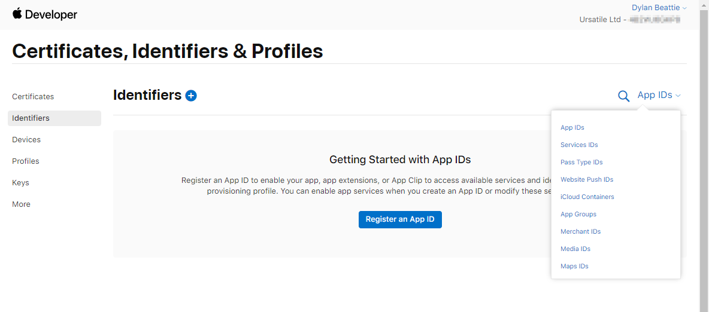
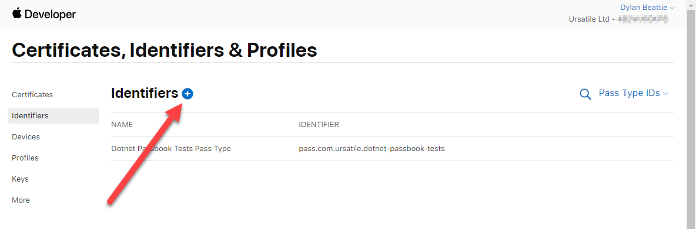
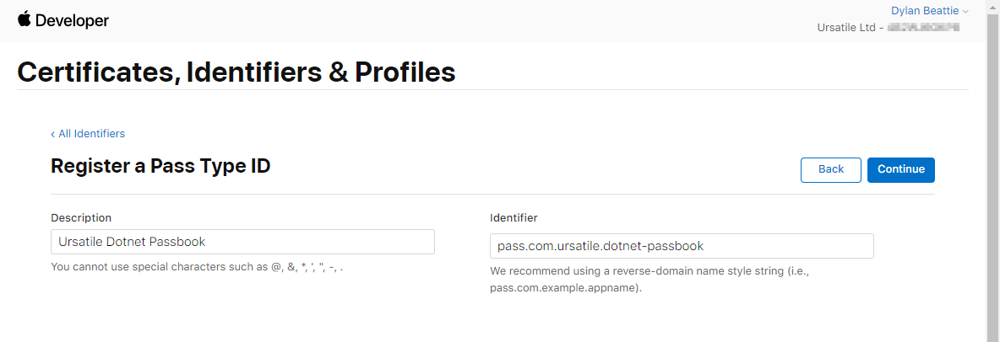
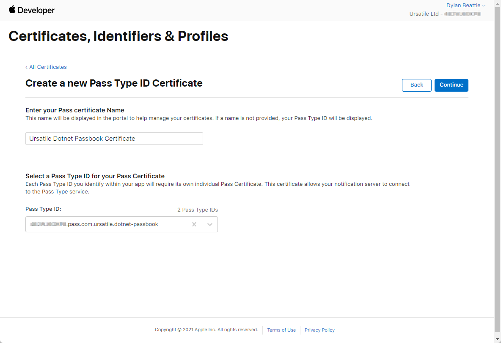
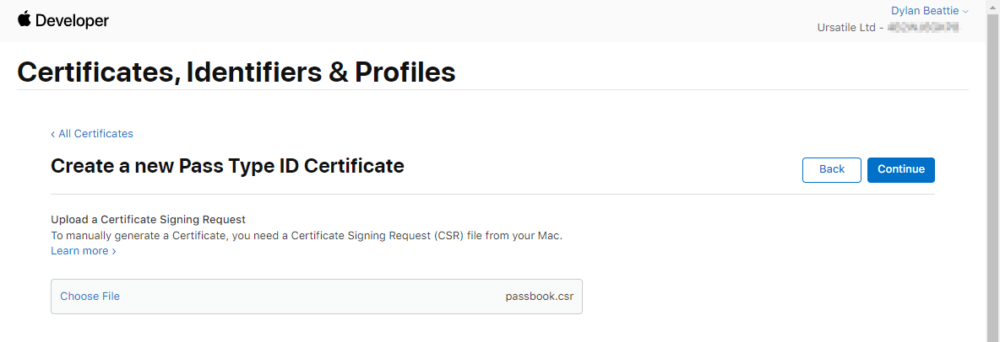
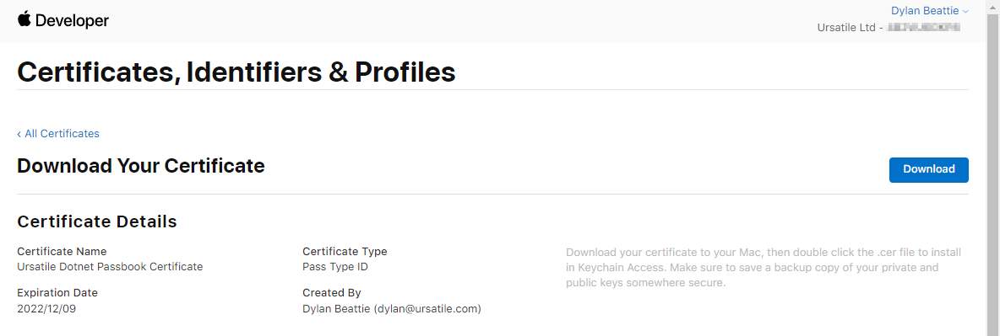

# Creating dotnet-passbook certificates using OpenSSL

Using **dotnet-passbook** requires two certificates: the Apple Worldwide Developer Relations certificate (G1), available from Apple, and a second certificate which is specific to your application. Here's how to create them using OpenSSL if you can't (or don't want to) use IIS and the Windows certificate store.

#### Overview:

1. Download the Apple WWDR Certificate
2. Create a **Pass Type ID** using the Apple Developer portal
3. Create a **certificate signing request** (CSR) using OpenSSL
4. Use the Apple Developer portal to sign your CSR and create `pass.cer` which contains your passbook certificate.
5. Use OpenSSL to convert `pass.cer` from a binary-encoded DER format into a plain text `PEM` format.
6. Use OpenSSL to convert your `PEM` passbook certificate into PKCS12 (`.pfx`) format
7. Add the Apple WWDR Certificate and your PKCS12 certificate to your application.
8. Specify the paths to these two files when creating your passbook request.

#### Prerequisites

* An Apple Developer account / subscription.
* [OpenSSL](https://www.openssl.org/)

#### Download the Apple WWDR certificate

You'll need the **Worldwide Developer Relations** certificate provided by Apple. 

Download the certificate from [https://developer.apple.com/certificationauthority/AppleWWDRCA.cer](https://developer.apple.com/certificationauthority/AppleWWDRCA.cer ) 

Save this certificate to your project folder as `AppleWWDRCA.cer`

> ⚠️ The page at [https://www.apple.com/certificateauthority/](https://www.apple.com/certificateauthority/) links to multiple versions (generations?) of the Worldwide Developer Relations certificate (G1, G2, G3, G5 and G6). 
>
> **Only G1 will generate valid Apple Wallet passes.**
>
> The others will work, you'll get a signed that works OK with Passbook, but when you try to save the generated `.pkpass` to your Apple Wallet you'll get an error that says *"Sorry, your Pass cannot be installed to Passbook at this time."*

#### Create a Pass Type ID

Sign in to your Apple Developer account and go to **Certificates, Identifiers & Profiles**

Click **Identifiers**. In the **App IDs** dropdown at top right, select **Pass Type IDs**:



If you have any existing **Pass Type IDs**, you'll see them listed here. To create a new one, click the blue plus icon next to Identifiers:



Provide a description (friendly and human readable), and an identifer (`pass.com.company.appname` or something similar):



### Generate a Certificate Signing Request using openSSL

The OpenSSL command to to this is:

```bash
openssl req -new -newkey rsa:2048 -out passbook.csr -keyout passbook.key
```

* `openssl req` runs openssl and specifies we're working with certificate signing requests (CSRs)
* `-new` creates a new CSR
* `-newkey rsa:2048` specifies that our CSR should be signed using a new 2048-bit RSA key
* `-out passbook.csr` specifies the output filename for our **certificate signing request**
* `-keyout passbook.key` specifies the output filename for our **signing key**

OpenSSL will prompt you for a bunch of details. First, it'll ask you for a passphrase. **Remember what this is - you'll need it every time you do anything with your signing key.**

```bash
Generating a RSA private key
............+++++
.................................................+++++
writing new private key to 'passbook.key'
Enter PEM pass phrase:
Verifying - Enter PEM pass phrase:
```

Next it'll prompt you for a bunch of details to include in the CSR:

```bash
-----
You are about to be asked to enter information that will be incorporated
into your certificate request.
What you are about to enter is what is called a Distinguished Name or a DN.
There are quite a few fields but you can leave some blank
For some fields there will be a default value,
If you enter '.', the field will be left blank.
-----
Country Name (2 letter code) [XX]:GB
State or Province Name (full name) []:London
Locality Name (eg, city) [Default City]:London
Organization Name (eg, company) [Default Company Ltd]:Ursatile Ltd
Organizational Unit Name (eg, section) []:iOS Development
Common Name (eg, your name or your server hostname) []:passbook.ursatile.com
Email Address []:passbook@ursatile.com

Please enter the following 'extra' attributes
to be sent with your certificate request
A challenge password []:
An optional company name []:
```

That's it. You should now have two new files:

* `passbook.key` contains your private signing key
* `passbook.csr` contains your certificate signing request

> ℹ️ You can also specify all these parameters via the -`subj` argument to OpenSSL:
>
> ```bash
> openssl req -new -newkey rsa:2048 -out passbook.csr -keyout passbook.key \
>   -subj "/C=GB/ST=London/L=London/O=Ursatile Ltd/OU=iOS Development/CN=passbook.ursatile.com"
> ```

#### Use the Apple Developer portal to sign your CSR

Sign in to the Apple Developer portal, go to **Certificates**, Add, **scroll** down to **Services**, select **Pass Type ID Certificate**:


Click Continue. Provide a Pass certificate name, and choose the Pass Type ID you selected in step 2:



Upload the `passbook.csr` file you created earlier using openSSL:



Your certificate has been created. When you click **Download**, you'll get a `pass.cer` file. Save this into your project folder.



#### Convert your certificate to a format you can use with Passbook

First, you'll need to convert `pass.cer` from a DER binary-encoded format into a PEM (text) certificate format:

```bash
openssl x509 -in pass.cer -inform der -out passbook.pem
```

Next convert the PEM file into a PKCS12 file you can use in your .NET application:

```
openssl pkcs12 -export -out passbook.pfx -inkey passbook.key -in passbook.pem
```

You'll need to enter the pass phrase for your private signing key, and then specify an **Export Password** (twice):

```html
Enter pass phrase for passbook.key:
Enter Export Password: <your_export_password>
Verifying - Enter Export Password: <your_export_password>
```

### Using your certificates to sign Apple Wallet passes with Dotnet Passbook

You'll need to include this **export password** when you create your passbook request in your .NET application:

```csharp
var request = new PassGeneratorRequest();
request.AppleWWDRCACertificate = File.ReadAllBytes("AppleWWDRCA.cer");
request.Certificate = File.ReadAllBytes("passbook.pfx");
request.CertificatePassword = "<your_export_password>";
```

